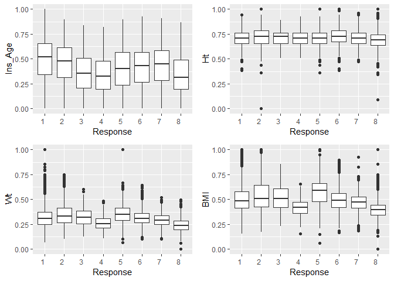
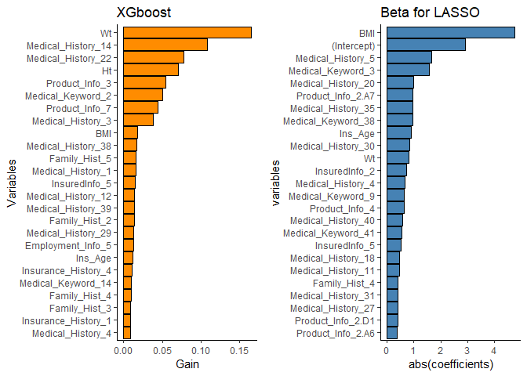

Prudential Life Insurance Assessment Life
================
*Jinwan*

Import required packages
------------------------

``` r
library("dplyr")
library("ggplot2")
library("VIM")
library("mlr")
library("knitr")
library("gridExtra")
library("parallelMap")
library("xgboost")
library("caTools")
```

Load data
---------

``` r
# Load data
mtrain <- read.csv('train.csv')
mtest <- read.csv('test.csv')
```

# 1. Missing values
-----------------

``` r
# Categorical variables
categorical_var <- c('Product_Info_1', 'Product_Info_2', 'Product_Info_3', 'Product_Info_5',
                  'Product_Info_6', 'Product_Info_7', 'Employment_Info_2', 'Employment_Info_3',
                  'Employment_Info_5', 'InsuredInfo_1', 'InsuredInfo_2', 'InsuredInfo_3',
                  'InsuredInfo_4', 'InsuredInfo_5', 'InsuredInfo_6', 'InsuredInfo_7',
                  'Insurance_History_1', 'Insurance_History_2', 'Insurance_History_3', 'Insurance_History_4',
                  'Insurance_History_7', 'Insurance_History_8', 'Insurance_History_9', 'Family_Hist_1',
                  'Medical_History_2', 'Medical_History_3', 'Medical_History_4', 'Medical_History_5',
                  'Medical_History_6', 'Medical_History_7', 'Medical_History_8', 'Medical_History_9',
                  'Medical_History_11', 'Medical_History_12', 'Medical_History_13', 'Medical_History_14',
                  'Medical_History_16', 'Medical_History_17', 'Medical_History_18', 'Medical_History_19',
                  'Medical_History_20', 'Medical_History_21', 'Medical_History_22', 'Medical_History_23',
                  'Medical_History_25', 'Medical_History_26', 'Medical_History_27', 'Medical_History_28',
                  'Medical_History_29', 'Medical_History_30', 'Medical_History_31', 'Medical_History_33',
                  'Medical_History_34', 'Medical_History_35', 'Medical_History_36', 'Medical_History_37',
                  'Medical_History_38', 'Medical_History_39', 'Medical_History_40', 'Medical_History_41')

# discrete variables
discrete_var <- c("Medical_History_1", "Medical_History_10", "Medical_History_15", 
                "Medical_History_24", "Medical_History_32")

# continuous variables
continuous_var <- c('Product_Info_4', 'Ins_Age', 'Ht', 'Wt', 'BMI', 'Employment_Info_1', 
                 'Employment_Info_4', 'Employment_Info_6', 'Insurance_History_5', 
                 'Family_Hist_2', 'Family_Hist_3', 'Family_Hist_4', 'Family_Hist_5')
# dummy variables
dummy_var <- paste0('Medical_Keyword_',c(1:48))

# Missing values
sum(mtrain[categorical_var] %>% is.na())
```

    ## [1] 0

``` r
sum(mtrain[dummy_var] %>% is.na())
```

    ## [1] 0

``` r
colSums(mtrain[discrete_var] %>% is.na())
```

    ##  Medical_History_1 Medical_History_10 Medical_History_15 
    ##               8889              58824              44596 
    ## Medical_History_24 Medical_History_32 
    ##              55580              58274

``` r
colSums(mtrain[continuous_var] %>% is.na())
```

    ##      Product_Info_4             Ins_Age                  Ht 
    ##                   0                   0                   0 
    ##                  Wt                 BMI   Employment_Info_1 
    ##                   0                   0                  19 
    ##   Employment_Info_4   Employment_Info_6 Insurance_History_5 
    ##                6779               10854               25396 
    ##       Family_Hist_2       Family_Hist_3       Family_Hist_4 
    ##               28656               34241               19184 
    ##       Family_Hist_5 
    ##               41811

``` r
# colSums(mtest[categorical_var] %>% is.na())
# colSums(mtest[dummy_var] %>% is.na())
# colSums(mtest[discrete_var] %>% is.na())
# colSums(mtest[continuous_var] %>% is.na())
print("No missing values in Categorical and Dummy Variables")
```

    ## [1] "No missing values in Categorical and Dummy Variables"

``` r
# merge
mtest$Response <- 0
dataset <- bind_rows(mtrain,mtest)
```

### 1.1 Missing values (barplot)

``` r
# Missing plot
plot_missing <- function(data, dataType="data"){
  data_NA <-
    data %>% 
    is.na() %>% 
    colSums() %>% 
    sort(decreasing=TRUE)
  if (dataType == "train"){
    fill_col <- "steelblue"
  }else if (dataType == "test"){
    fill_col <- "#FF6666"
  }else{
    fill_col <- "green"
  }
  data_NA <- data_NA[data_NA>0] 
  data_NA <- data_NA %>% as.data.frame()
  data_NA <- data.frame(name=rownames(data_NA), missing=data_NA[,1])
  plot_result <- 
    ggplot(data=data_NA, aes(x=name, y=missing)) +
    geom_bar(stat="identity", fill=fill_col, colour="black")+
    # geom_text(aes(label=name), vjust=-0.3, size=3.5)+
    labs(title=paste("Barplot for",dataType,by=" "),
         x="variables",
         y="number of missing values") +
    theme(axis.text.x=element_text(angle = 45, hjust = 1))
  return(plot_result)
}

# Plot number of missing values in different datset
plot1 <- plot_missing(mtrain,"train")
plot2 <- plot_missing(mtest, "test")
plot3 <- plot_missing(dataset, "all_data")
grid.arrange(plot1, plot2, plot3, ncol=3)
```


### 1.2 Missing value pattern plot

``` r
# missing value pattern plot
missing_pattern_plot <- function(data_in, graphTitle="", isComplete=TRUE){
  col_missing <- colnames(data_in)[(colSums(is.na(data_in)) > 0)]
  if (isComplete){data_in_y <- data_in[,'Response']}
  data_in <- data_in[col_missing]
  r <- as.data.frame(ifelse(is.na(data_in), 0, 1))
  r <- r[,order(colMeans(is.na(data_in)))]
  data_temp <- expand.grid(list(y=1:nrow(r), x=colnames(r)))
  data_temp$r <- r %>% as.matrix() %>% as.vector()
  plot_res<-list()
  plot_res[[1]] <- ggplot(data_temp) +
    geom_tile(aes(x=x, y=y, fill=factor(r))) + 
    scale_fill_manual(values=c("navy", "grey"), 
                      name="Missing\n(0=Yes, 1=No)") + 
    theme(axis.text.x=element_text(hjust=1,size=10, angle=45), 
          legend.position="top",
          legend.text=element_text(size=8),
          legend.key.width = unit(0.7, "cm"),
          legend.key.height = unit(0.7, "cm")) +
    ggtitle(paste0("Missing plot: ",graphTitle)) + ylab("") + xlab("")
  if (isComplete){
    data_temp <- data.frame(y=1:length(data_in_y), x=data_in_y)
    data_temp$data_in_y <- data_in_y
    plot_res[[2]] <- ggplot(data_temp) +
      geom_tile(aes(x=x, y=y, fill=factor(data_in_y))) +
      scale_fill_manual(values=c(1:length(factor(data_in_y))),
                        name="Response") +
      scale_x_continuous(breaks=seq(min(data_in_y),max(data_in_y),1)) +
      theme(axis.text.x=element_text(hjust=0.5,size=10),
            legend.position="top",
            legend.text=element_text(size=8),
            legend.key.width = unit(0.35, "cm"),
            legend.key.height = unit(0.35, "cm")) +
      ggtitle("Response plot") + ylab("") + xlab("")
    g1 <- ggplotGrob(plot_res[[1]])
    g2 <- ggplotGrob(plot_res[[2]])
    g2$heights <- g1$heights
    res <- list(g1,g2)
    return(res)
  }else{
    return(plot_res)
  }
}
missing_pattern <- missing_pattern_plot(mtrain,  graphTitle="training set")
do.call(what = grid.arrange, arg = c(missing_pattern,
                                     list(ncol=2, nrow=1, widths=c(4,3))) )
```


``` r
missing_pattern_cont <- missing_pattern_plot(mtrain[continuous_var], 
                                              graphTitle = "training set (continuous var)", isComplete=FALSE)
do.call(what = grid.arrange, arg = c(missing_pattern_cont, list(ncol=2, nrow=1, widths=c(4,3))) )
```


# 2. Data visualization (missing values are ignored)
--------------------------------------------------

### 2.1 Categorical and dummy variables

``` r
# plot barplot
bar_plot <- function(data_in){
  plot_list <- list()
  for( i in (1:(dim(data_in)[2])) ){
    temp_table <- data_in[,i]
    temp_table <- data_in[,i] %>% 
      table() %>% 
      as.data.frame() 
    colnames(temp_table) <- c('values', 'freq')
    plot_list[[i]] <- 
      ggplot(data=temp_table, aes(x=values, y=freq)) +
      geom_bar(stat="identity", fill="dodgerblue", colour="black")+
      # geom_text(aes(label=name), vjust=-0.3, size=3.5)+
      labs(title=paste("Barplot #",i, by=""),
           x=colnames(data_in)[i],
           y="freq") +
      theme(axis.text.x=element_text(hjust=1,size=7), 
            axis.title=element_text(size=8,face="bold"),
            plot.title = element_text(size=9))
  }
  return(plot_list)
}

lay_out <- rbind(c(1,2,3,4),
                 c(5,6,7,8),
                 c(9,10,11,12))
# categorical variables plot
plot_categorical <- bar_plot(mtrain[categorical_var])
marrangeGrob(plot_categorical,nrow=3,ncol=4, layout_matrix=lay_out)
```


``` r
# dummy variable plot
plot_dummy <- bar_plot(mtrain[dummy_var])
marrangeGrob(plot_dummy,nrow=3,ncol=4)
```


### 2.2 Discrete and continuous variables

``` r
# plot histogram 
hist_plot <- function(data_in){
  plot_list <- list()
  for( i in (1:(dim(data_in)[2])) ){
    temp_name <- colnames(data_in)[i]
    temp_table <- data_in[,i] %>% as.data.frame()
    temp_table <- na.omit(temp_table)
    
    colnames(temp_table) <- "values"
    plot_list[[i]] <- 
      ggplot(data=temp_table, aes(x=values)) +
      geom_histogram(bins=20, fill="dodgerblue", colour="black")+
      # geom_text(aes(label=name), vjust=-0.3, size=3.5)+
      labs(title=paste("Histogram #",i, by=""),
           x=colnames(data_in)[i],
           y="freq") +
      theme(axis.text.x=element_text(hjust=1,size=7), 
            axis.title=element_text(size=8,face="bold"),
            plot.title = element_text(size=9))
  }
  return(plot_list)
}
# discrete variable plot
plot_discrete <- hist_plot(mtrain[discrete_var])
marrangeGrob(plot_discrete,nrow=3,ncol=4)
```


``` r
print( "There exist skewnees in some discrete variables")
```

    ## [1] "There exist skewnees in some discrete variables"

``` r
# continuous variable plot
plot_continuous <- hist_plot(mtrain[continuous_var])
marrangeGrob(plot_continuous,nrow=3,ncol=4)
```


``` r
print( "There exist skewnees in some continuous variables")
```

    ## [1] "There exist skewnees in some continuous variables"

### 2.2 Correlation plots

``` r
# Correlation plot
nearZero_column <- caret::nearZeroVar(mtrain)
mtrain_num <- mtrain[, -nearZero_column]
mtrain_num$Product_Info_2 <- mtrain_num$Product_Info_2 %>% as.numeric()
col_without_na <- (mtrain_num %>% is.na() %>% colSums()) == 0
mtrain_wo_na <- mtrain_num[col_without_na] %>% select(-c(Id, Response))
# omit missing values
is.na(mtrain_wo_na) %>% sum()
```

    ## [1] 0

``` r
insured_info <- colnames(mtrain_wo_na)[substr(colnames(mtrain_wo_na),1,7) == 'Insured']
prod_info <- colnames(mtrain_wo_na)[substr(colnames(mtrain_wo_na),1,7) == 'Product']
mtrain_wo_na <- mtrain_wo_na %>% select(-c(insured_info, prod_info))
corr_df <- cor(mtrain_wo_na)
corrplot::corrplot(corr_df, tl.cex=0.7)
```


``` r
corrplot::corrplot(corr_df, tl.cex=0.7, method = 'color', order='hclust', type='upper')
```


# 3. Data imputation and some boxplots
------------------------------------

### 3.1 Imputation

Missing values are replaced with 1) the median for integer/numeric values 2) the mode for factor variables

``` r
imputer <- impute(dataset,
                  classes = list(integer = imputeMedian(),
                                 numeric = imputeMedian(),
                                 factor = imputeMode()))
dataset_imp <- imputer$data
dataset_imp %>% summarizeColumns() %>% kable(digits=2)
```

| name                  | type    |   na|      mean|      disp|    median|       mad|  min|    max|  nlevs|
|:----------------------|:--------|----:|---------:|---------:|---------:|---------:|----:|------:|------:|
| Id                    | numeric |    0|  39573.50|  22847.63|  39573.50|  29335.46|    1|  79146|      0|
| Product\_Info\_1      | numeric |    0|      1.03|      0.16|      1.00|      0.00|    1|      2|      0|
| Product\_Info\_2      | factor  |    0|        NA|      0.76|        NA|        NA|   85|  18753|     19|
| Product\_Info\_3      | numeric |    0|     24.39|      5.10|     26.00|      0.00|    1|     38|      0|
| Product\_Info\_4      | numeric |    0|      0.33|      0.28|      0.23|      0.23|    0|      1|      0|
| Product\_Info\_5      | numeric |    0|      2.01|      0.08|      2.00|      0.00|    2|      3|      0|
| Product\_Info\_6      | numeric |    0|      2.67|      0.74|      3.00|      0.00|    1|      3|      0|
| Product\_Info\_7      | numeric |    0|      1.04|      0.29|      1.00|      0.00|    1|      3|      0|
| Ins\_Age              | numeric |    0|      0.41|      0.20|      0.42|      0.24|    0|      1|      0|
| Ht                    | numeric |    0|      0.71|      0.07|      0.71|      0.08|    0|      1|      0|
| Wt                    | numeric |    0|      0.29|      0.09|      0.29|      0.09|    0|      1|      0|
| BMI                   | numeric |    0|      0.47|      0.12|      0.45|      0.11|    0|      1|      0|
| Employment\_Info\_1   | numeric |    0|      0.08|      0.08|      0.06|      0.04|    0|      1|      0|
| Employment\_Info\_2   | numeric |    0|      8.59|      4.22|      9.00|      0.00|    1|     38|      0|
| Employment\_Info\_3   | numeric |    0|      1.31|      0.72|      1.00|      0.00|    1|      3|      0|
| Employment\_Info\_4   | numeric |    0|      0.01|      0.03|      0.00|      0.00|    0|      1|      0|
| Employment\_Info\_5   | numeric |    0|      2.14|      0.35|      2.00|      0.00|    2|      3|      0|
| Employment\_Info\_6   | numeric |    0|      0.34|      0.32|      0.25|      0.27|    0|      1|      0|
| InsuredInfo\_1        | numeric |    0|      1.21|      0.42|      1.00|      0.00|    1|      3|      0|
| InsuredInfo\_2        | numeric |    0|      2.01|      0.09|      2.00|      0.00|    2|      3|      0|
| InsuredInfo\_3        | numeric |    0|      5.80|      2.75|      6.00|      2.97|    1|     11|      0|
| InsuredInfo\_4        | numeric |    0|      2.89|      0.32|      3.00|      0.00|    2|      3|      0|
| InsuredInfo\_5        | numeric |    0|      1.03|      0.23|      1.00|      0.00|    1|      3|      0|
| InsuredInfo\_6        | numeric |    0|      1.41|      0.49|      1.00|      0.00|    1|      2|      0|
| InsuredInfo\_7        | numeric |    0|      1.04|      0.27|      1.00|      0.00|    1|      3|      0|
| Insurance\_History\_1 | numeric |    0|      1.72|      0.45|      2.00|      0.00|    1|      2|      0|
| Insurance\_History\_2 | numeric |    0|      1.05|      0.32|      1.00|      0.00|    1|      3|      0|
| Insurance\_History\_3 | numeric |    0|      2.16|      0.99|      3.00|      0.00|    1|      3|      0|
| Insurance\_History\_4 | numeric |    0|      1.95|      0.95|      2.00|      1.48|    1|      3|      0|
| Insurance\_History\_5 | numeric |    0|      0.00|      0.00|      0.00|      0.00|    0|      1|      0|
| Insurance\_History\_7 | numeric |    0|      1.90|      0.97|      1.00|      0.00|    1|      3|      0|
| Insurance\_History\_8 | numeric |    0|      2.05|      0.76|      2.00|      1.48|    1|      3|      0|
| Insurance\_History\_9 | numeric |    0|      2.41|      0.51|      2.00|      0.00|    1|      3|      0|
| Family\_Hist\_1       | numeric |    0|      2.69|      0.48|      3.00|      0.00|    1|      3|      0|
| Family\_Hist\_2       | numeric |    0|      0.47|      0.11|      0.46|      0.00|    0|      1|      0|
| Family\_Hist\_3       | numeric |    0|      0.51|      0.09|      0.52|      0.00|    0|      1|      0|
| Family\_Hist\_4       | numeric |    0|      0.44|      0.13|      0.44|      0.08|    0|      1|      0|
| Family\_Hist\_5       | numeric |    0|      0.50|      0.07|      0.51|      0.00|    0|      1|      0|
| Medical\_History\_1   | integer |    0|      7.34|     11.99|      4.00|      4.45|    0|    240|      0|
| Medical\_History\_2   | numeric |    0|    252.94|    178.46|    162.00|    146.78|    1|    648|      0|
| Medical\_History\_3   | numeric |    0|      2.11|      0.32|      2.00|      0.00|    1|      3|      0|
| Medical\_History\_4   | numeric |    0|      1.66|      0.48|      2.00|      0.00|    1|      2|      0|
| Medical\_History\_5   | numeric |    0|      1.01|      0.09|      1.00|      0.00|    1|      3|      0|
| Medical\_History\_6   | numeric |    0|      2.89|      0.46|      3.00|      0.00|    1|      3|      0|
| Medical\_History\_7   | numeric |    0|      2.01|      0.17|      2.00|      0.00|    1|      3|      0|
| Medical\_History\_8   | numeric |    0|      2.04|      0.29|      2.00|      0.00|    1|      3|      0|
| Medical\_History\_9   | numeric |    0|      1.77|      0.42|      2.00|      0.00|    1|      3|      0|
| Medical\_History\_10  | numeric |    0|    224.22|     13.10|    225.00|      0.00|    0|    240|      0|
| Medical\_History\_11  | numeric |    0|      2.99|      0.09|      3.00|      0.00|    1|      3|      0|
| Medical\_History\_12  | numeric |    0|      2.06|      0.23|      2.00|      0.00|    1|      3|      0|
| Medical\_History\_13  | numeric |    0|      2.77|      0.64|      3.00|      0.00|    1|      3|      0|
| Medical\_History\_14  | numeric |    0|      2.97|      0.20|      3.00|      0.00|    1|      3|      0|
| Medical\_History\_15  | numeric |    0|    118.80|     49.31|    117.00|      0.00|    0|    240|      0|
| Medical\_History\_16  | numeric |    0|      1.33|      0.74|      1.00|      0.00|    1|      3|      0|
| Medical\_History\_17  | numeric |    0|      2.98|      0.15|      3.00|      0.00|    1|      3|      0|
| Medical\_History\_18  | numeric |    0|      1.05|      0.23|      1.00|      0.00|    1|      3|      0|
| Medical\_History\_19  | numeric |    0|      1.03|      0.18|      1.00|      0.00|    1|      3|      0|
| Medical\_History\_20  | numeric |    0|      1.99|      0.12|      2.00|      0.00|    1|      3|      0|
| Medical\_History\_21  | numeric |    0|      1.11|      0.31|      1.00|      0.00|    1|      3|      0|
| Medical\_History\_22  | numeric |    0|      1.98|      0.13|      2.00|      0.00|    1|      2|      0|
| Medical\_History\_23  | numeric |    0|      2.52|      0.86|      3.00|      0.00|    1|      3|      0|
| Medical\_History\_24  | integer |    0|     10.67|     22.10|      8.00|      0.00|    0|    240|      0|
| Medical\_History\_25  | numeric |    0|      1.20|      0.41|      1.00|      0.00|    1|      3|      0|
| Medical\_History\_26  | numeric |    0|      2.81|      0.39|      3.00|      0.00|    1|      3|      0|
| Medical\_History\_27  | numeric |    0|      2.98|      0.20|      3.00|      0.00|    1|      3|      0|
| Medical\_History\_28  | numeric |    0|      1.07|      0.25|      1.00|      0.00|    1|      3|      0|
| Medical\_History\_29  | numeric |    0|      2.55|      0.84|      3.00|      0.00|    1|      3|      0|
| Medical\_History\_30  | numeric |    0|      2.04|      0.20|      2.00|      0.00|    1|      3|      0|
| Medical\_History\_31  | numeric |    0|      2.99|      0.17|      3.00|      0.00|    1|      3|      0|
| Medical\_History\_32  | numeric |    0|      0.22|      5.42|      0.00|      0.00|    0|    240|      0|
| Medical\_History\_33  | numeric |    0|      2.80|      0.60|      3.00|      0.00|    1|      3|      0|
| Medical\_History\_34  | numeric |    0|      2.69|      0.72|      3.00|      0.00|    1|      3|      0|
| Medical\_History\_35  | numeric |    0|      1.00|      0.07|      1.00|      0.00|    1|      3|      0|
| Medical\_History\_36  | numeric |    0|      2.18|      0.41|      2.00|      0.00|    1|      3|      0|
| Medical\_History\_37  | numeric |    0|      1.94|      0.24|      2.00|      0.00|    1|      3|      0|
| Medical\_History\_38  | numeric |    0|      1.00|      0.07|      1.00|      0.00|    1|      3|      0|
| Medical\_History\_39  | numeric |    0|      2.83|      0.56|      3.00|      0.00|    1|      3|      0|
| Medical\_History\_40  | numeric |    0|      2.97|      0.25|      3.00|      0.00|    1|      3|      0|
| Medical\_History\_41  | numeric |    0|      1.64|      0.93|      1.00|      0.00|    1|      3|      0|
| Medical\_Keyword\_1   | numeric |    0|      0.04|      0.20|      0.00|      0.00|    0|      1|      0|
| Medical\_Keyword\_2   | numeric |    0|      0.01|      0.09|      0.00|      0.00|    0|      1|      0|
| Medical\_Keyword\_3   | numeric |    0|      0.05|      0.22|      0.00|      0.00|    0|      1|      0|
| Medical\_Keyword\_4   | numeric |    0|      0.01|      0.12|      0.00|      0.00|    0|      1|      0|
| Medical\_Keyword\_5   | numeric |    0|      0.01|      0.09|      0.00|      0.00|    0|      1|      0|
| Medical\_Keyword\_6   | numeric |    0|      0.01|      0.11|      0.00|      0.00|    0|      1|      0|
| Medical\_Keyword\_7   | numeric |    0|      0.01|      0.12|      0.00|      0.00|    0|      1|      0|
| Medical\_Keyword\_8   | numeric |    0|      0.01|      0.10|      0.00|      0.00|    0|      1|      0|
| Medical\_Keyword\_9   | numeric |    0|      0.01|      0.08|      0.00|      0.00|    0|      1|      0|
| Medical\_Keyword\_10  | numeric |    0|      0.04|      0.19|      0.00|      0.00|    0|      1|      0|
| Medical\_Keyword\_11  | numeric |    0|      0.06|      0.24|      0.00|      0.00|    0|      1|      0|
| Medical\_Keyword\_12  | numeric |    0|      0.01|      0.10|      0.00|      0.00|    0|      1|      0|
| Medical\_Keyword\_13  | numeric |    0|      0.01|      0.08|      0.00|      0.00|    0|      1|      0|
| Medical\_Keyword\_14  | numeric |    0|      0.01|      0.09|      0.00|      0.00|    0|      1|      0|
| Medical\_Keyword\_15  | numeric |    0|      0.19|      0.39|      0.00|      0.00|    0|      1|      0|
| Medical\_Keyword\_16  | numeric |    0|      0.01|      0.11|      0.00|      0.00|    0|      1|      0|
| Medical\_Keyword\_17  | numeric |    0|      0.01|      0.10|      0.00|      0.00|    0|      1|      0|
| Medical\_Keyword\_18  | numeric |    0|      0.01|      0.09|      0.00|      0.00|    0|      1|      0|
| Medical\_Keyword\_19  | numeric |    0|      0.01|      0.10|      0.00|      0.00|    0|      1|      0|
| Medical\_Keyword\_20  | numeric |    0|      0.01|      0.09|      0.00|      0.00|    0|      1|      0|
| Medical\_Keyword\_21  | numeric |    0|      0.01|      0.12|      0.00|      0.00|    0|      1|      0|
| Medical\_Keyword\_22  | numeric |    0|      0.04|      0.19|      0.00|      0.00|    0|      1|      0|
| Medical\_Keyword\_23  | numeric |    0|      0.10|      0.30|      0.00|      0.00|    0|      1|      0|
| Medical\_Keyword\_24  | numeric |    0|      0.02|      0.14|      0.00|      0.00|    0|      1|      0|
| Medical\_Keyword\_25  | numeric |    0|      0.09|      0.29|      0.00|      0.00|    0|      1|      0|
| Medical\_Keyword\_26  | numeric |    0|      0.01|      0.11|      0.00|      0.00|    0|      1|      0|
| Medical\_Keyword\_27  | numeric |    0|      0.01|      0.11|      0.00|      0.00|    0|      1|      0|
| Medical\_Keyword\_28  | numeric |    0|      0.01|      0.12|      0.00|      0.00|    0|      1|      0|
| Medical\_Keyword\_29  | numeric |    0|      0.01|      0.11|      0.00|      0.00|    0|      1|      0|
| Medical\_Keyword\_30  | numeric |    0|      0.02|      0.16|      0.00|      0.00|    0|      1|      0|
| Medical\_Keyword\_31  | numeric |    0|      0.01|      0.10|      0.00|      0.00|    0|      1|      0|
| Medical\_Keyword\_32  | numeric |    0|      0.02|      0.14|      0.00|      0.00|    0|      1|      0|
| Medical\_Keyword\_33  | numeric |    0|      0.02|      0.15|      0.00|      0.00|    0|      1|      0|
| Medical\_Keyword\_34  | numeric |    0|      0.02|      0.14|      0.00|      0.00|    0|      1|      0|
| Medical\_Keyword\_35  | numeric |    0|      0.01|      0.08|      0.00|      0.00|    0|      1|      0|
| Medical\_Keyword\_36  | numeric |    0|      0.01|      0.10|      0.00|      0.00|    0|      1|      0|
| Medical\_Keyword\_37  | numeric |    0|      0.07|      0.25|      0.00|      0.00|    0|      1|      0|
| Medical\_Keyword\_38  | numeric |    0|      0.01|      0.08|      0.00|      0.00|    0|      1|      0|
| Medical\_Keyword\_39  | numeric |    0|      0.01|      0.12|      0.00|      0.00|    0|      1|      0|
| Medical\_Keyword\_40  | numeric |    0|      0.06|      0.23|      0.00|      0.00|    0|      1|      0|
| Medical\_Keyword\_41  | numeric |    0|      0.01|      0.10|      0.00|      0.00|    0|      1|      0|
| Medical\_Keyword\_42  | numeric |    0|      0.05|      0.21|      0.00|      0.00|    0|      1|      0|
| Medical\_Keyword\_43  | numeric |    0|      0.01|      0.10|      0.00|      0.00|    0|      1|      0|
| Medical\_Keyword\_44  | numeric |    0|      0.01|      0.09|      0.00|      0.00|    0|      1|      0|
| Medical\_Keyword\_45  | numeric |    0|      0.01|      0.12|      0.00|      0.00|    0|      1|      0|
| Medical\_Keyword\_46  | numeric |    0|      0.01|      0.09|      0.00|      0.00|    0|      1|      0|
| Medical\_Keyword\_47  | numeric |    0|      0.02|      0.14|      0.00|      0.00|    0|      1|      0|
| Medical\_Keyword\_48  | numeric |    0|      0.05|      0.23|      0.00|      0.00|    0|      1|      0|
| Response              | numeric |    0|      4.23|      3.24|      5.00|      4.45|    0|      8|      0|

### 3.2 Boxplots

``` r
box_plot <- function(data_in,col_names){
  plot_list <- list()
  for( i in (1:length(col_names))){
    temp_dat <- data_in[c(col_names[i],'Response')]
    colnames(temp_dat) <- c('value','Response')
    plot_list[[i]] <- 
      ggplot(temp_dat, aes(x=factor(Response), y=value)) + 
      # ggtitle(paste("Boxplot Response ~ ",col_names[i])) + 
      geom_boxplot() + 
      ylab(col_names[i]) + xlab('Response') +
      theme(axis.text.x=element_text(hjust=1))
  }
  return(plot_list)
}
bio_plot <- box_plot(mtrain, c('Ins_Age','Ht', 'Wt', 'BMI'))
do.call(what = grid.arrange, arg = c(bio_plot, list(ncol=2, nrow=2)) )
```



# 4. XGboost
----------

### 4.1 Split train/test, dummyfication and create Tasks

``` r
# dummification
dataset_imp <- imputer$data %>% createDummyFeatures(target="Response")
mtrain <- subset(dataset_imp, Response > 0)
mtest <- subset(dataset_imp, Response == 0)
mtest$Response <- NULL
mtrain$Id <- NULL

# split
set.seed(123)
split <- sample.split(c(1:nrow(mtrain)), SplitRatio = 0.7)
dtrain <- subset(mtrain, split == TRUE)
dtest <- subset(mtrain, split == FALSE)

# creating tasks
trainTask <- makeRegrTask(data=dtrain, target="Response")
testTask <- makeRegrTask(data=dtest, target="Response")

print(trainTask)
```

    ## Supervised task: dtrain
    ## Type: regr
    ## Target: Response
    ## Observations: 41566
    ## Features:
    ##    numerics     factors     ordered functionals 
    ##         144           0           0           0 
    ## Missings: FALSE
    ## Has weights: FALSE
    ## Has blocking: FALSE
    ## Has coordinates: FALSE

``` r
print(testTask)
```

    ## Supervised task: dtest
    ## Type: regr
    ## Target: Response
    ## Observations: 17815
    ## Features:
    ##    numerics     factors     ordered functionals 
    ##         144           0           0           0 
    ## Missings: FALSE
    ## Has weights: FALSE
    ## Has blocking: FALSE
    ## Has coordinates: FALSE

### 4.2 Define Evaluation Function (Kappa)

``` r
Quad_Weighted_Kappa_fun <- function(x = seq(1.5, 7.5, by = 1), pred) {
  preds <- pred$data$response
  true <- pred$data$truth 
  cuts <- c(min(preds), x[1], x[2], x[3], x[4], x[5], x[6], x[7], max(preds))
  preds <- as.numeric(Hmisc::cut2(preds, cuts))
  err <- Metrics::ScoreQuadraticWeightedKappa(preds, true, 1, 8)
  return(-err)
}
QWK_measure <- makeMeasure(id = "QWK_measure", minimize = FALSE, 
                           properties = c("regr"), 
                           best = 1, worst = 0,
                           fun = function(task, model, pred, feats, extra.args) {
                             return(-Quad_Weighted_Kappa_fun(x = seq(1.5, 7.5, by = 1), pred))
                           })
```

### 4.3 Parameter tuning

``` r
# # parallel computing
# parallelStartSocket(8)
# parallelExport("QWK_measure", "Quad_Weighted_Kappa_fun")

# # create learner
# xgb_lrn <- makeLearner(cl="regr.xgboost", 
#                        id="xgb_regr",
#                        predict.type = "response")

# xgb_lrn$par.vals <- list( # nrounds = 500,
#   print_every_n = 50,
#   objective = 'reg:linear')
# # Set the tuning parameters
# getParamSet("regr.xgboost")

# # tuning parameters
# xgb_param_set<- makeParamSet(
#   makeDiscreteParam("nrounds", values = c(200,500,800)),
#   makeNumericParam("eta", lower=0.05, upper=0.2),
#   # makeNumericParam("gamma", lower=0, upper=10),
#   # makeNumericParam("lambda", lower=0, upper=10),
#   makeIntegerParam("max_depth", lower=5, upper=10),
#   makeNumericParam("min_child_weight", lower=100, upper=500),
#   makeNumericParam("subsample", lower=0.5, upper=0.8),
#   makeNumericParam("colsample_bytree",lower = 0.5,upper = 0.8),
#   makeDiscreteParam("verbose", values = 1, tunable = FALSE)
# )

# # 4 folder cross validation for tuning
# cv_folds <- makeResampleDesc(method="CV", iters=4)

# # random search
# ctrl_random <-  makeTuneControlRandom(maxit = 100L)
# 
# # tuning
# xgb_tuned <- tuneParams(xgb_lrn,
#                         task = trainTask, resampling = cv_folds,
#                         par.set = xgb_param_set,
#                         control = ctrl_random,
#                         measures = QWK_measure)

# # set the best parameters
# xgb_tuned_model <- setHyperPars(xgb_lrn,
#                                 par.vals = xgb_tuned$x)
 
# # cross validation using the model to find optimal cuts
# cv <- crossval(xgb_tuned_model,
#                trainTask, iter = 4,
#                measures = QWK_measure,
#                show.info = TRUE)
# parallelStop()

# optimal_cuts <- optim(seq(1.5, 7.5, by = 1), Quad_Weighted_Kappa_fun, pred = cv$pred)
 
# # train the model to get final model
# xgb_best_model <- train(xgb_tuned_model,
#                         task = trainTask)

# # save the model
# save(xgb_best_model, file = "xgb_mod_ALL.rda")
# save(optimal_cuts, file = "optimal_cuts.rda")
load("xgb_mod_ALL.rda")
load("optimal_cuts.rda")
```

### 4.3 Prediction/Importance plot

``` r
pred <- predict(xgb_best_model, task=testTask)
true_y <- pred$data$truth
pred_y <- as.numeric(Hmisc::cut2(pred$data$response, c(-Inf, optimal_cuts$par, Inf)))
xgb_cm <- table(true=dtest$Response, pred=pred_y)
# misclassification rate
xgb_error <- 1 - sum(diag(xgb_cm))/sum(xgb_cm)
xgb_res <- (list(confusion_matrix=xgb_cm, misclassification=xgb_error))
print(xgb_res)
```

    ## $confusion_matrix
    ##     pred
    ## true    1    2    3    4    5    6    7    8
    ##    1  538  209  195  238  186  197  116  146
    ##    2  482  274  228  273  199  191  159  137
    ##    3  118   92   46   12   13    8    7    4
    ##    4   59  119  145   49   18   12   17   30
    ##    5  109  149  264  438  326  179   98   65
    ##    6   85  130  232  518  675  774  572  413
    ##    7   11   20   70  179  308  575  596  669
    ##    8    3    8   29   86  176  457 1029 4055
    ## 
    ## $misclassification
    ## [1] 0.62627

``` r
xgbImportance_df <- xgb.importance(dataset_imp %>% colnames(), 
                                   model = xgb_best_model %>% getLearnerModel()) %>% as.data.frame()
xgb_importance_plot <-
  ggplot(data=xgbImportance_df[1:25,], aes(x=reorder(Feature, abs(Gain)), y=(Gain))) +
  geom_bar(stat="identity", fill='darkorange', colour="black") +
  coord_flip() +
  labs(title=c('XGboost'),
       x="Variables",
       y="Gain") +
  theme_classic()
xgb_importance_plot
```

-1.png)

# 5. LASSO
--------

### 5.1 Train the model

``` r
lasso_lrn <- makeLearner('regr.cvglmnet')
lasso_lrn$par.set <- list(family = 'gaussian',
                          nfolds = 4,
                          nlambda = 100)

lasso_model <- train(lasso_lrn,
                     task = trainTask)
```

### 5.2 Prediction/Coefficient

``` r
# pred <- predict(lasso_model, task=testTask) # predict using lambda.1se
pred <- predict(lasso_model$learner.model,s=lasso_model$learner.model$lambda.min,
                 newx = as.matrix(dtest %>% select(-Response)), type='response') %>% as.vector()
true_y <- mtrain$Response
pred_y <- as.numeric(Hmisc::cut2(pred, seq(1.5, 7.5, by = 1))) 
# confusion matrix
lasso_cm <- table(true=dtest$Response, pred=pred_y)
# misclassification rate
lasso_error <- 1 - sum(diag(lasso_cm))/sum(lasso_cm)
lasso_res <- (list(confusion_matrix=lasso_cm, misclassification=lasso_error))
print(lasso_res)
```

    ## $confusion_matrix
    ##     pred
    ## true    1    2    3    4    5    6    7    8
    ##    1  151  152  249  374  414  305  158   22
    ##    2   98  146  293  433  455  362  141   15
    ##    3   11   19   69  106   67   22    5    1
    ##    4    1    4   33  123  170   88   27    3
    ##    5   12   51  119  285  598  440  113   10
    ##    6   10   34  156  447 1026 1263  433   30
    ##    7    0    4   20  121  516 1047  636   84
    ##    8    0    0    9   48  255 1454 2949 1128
    ## 
    ## $misclassification
    ## [1] 0.769071

``` r
# plot for lambdas
lasso_mod <- lasso_model$learner.model
plot(lasso_mod)
```

-1.png)

``` r
# plot for LASSO ceofficients (beta)      
coef_df <- coef(lasso_mod) %>% as.matrix() %>% reshape2::melt() %>% as.data.frame()
colnames(coef_df) <- c('names', 'dummy', 'coef')
coef_df <- coef_df[order(abs(coef_df$coef), decreasing=TRUE),]
lasso_coef_plot <-
  ggplot(data=coef_df[1:25,], aes(x=reorder(names, abs(coef)), y=abs(coef))) +
  geom_bar(stat="identity", fill='steelblue', colour="black") +
  coord_flip() +
  labs(title=c('Beta for LASSO'),
       x="variables",
       y="abs(coefficients)") +
  theme_classic()
head(coef_df)
```

    ##                  names dummy       coef
    ## 11                 BMI     1 -4.7504808
    ## 1          (Intercept)     1  2.8993955
    ## 42   Medical_History_5     1 -1.6672892
    ## 81   Medical_Keyword_3     1 -1.5658720
    ## 57  Medical_History_20     1  0.9977829
    ## 133  Product_Info_2.A7     1 -0.9676749

# 6. XGBoost and LASSO
--------------------

``` r
do.call(what = grid.arrange, arg = c(list(xgb_importance_plot, lasso_coef_plot), list(ncol=2, nrow=1)) )
```



``` r
nonZero_coef_df <- coef_df[coef_df$coef!=0,]
top50_columns <- intersect(xgbImportance_df$Feature[1:50], as.character(nonZero_coef_df$names)[1:50])
print("Top 50 in common: ")
```

    ## [1] "Top 50 in common: "

``` r
print(top50_columns)
```

    ##  [1] "Wt"                  "Medical_History_22"  "Medical_History_3"  
    ##  [4] "BMI"                 "Medical_History_38"  "Family_Hist_5"      
    ##  [7] "InsuredInfo_5"       "Family_Hist_2"       "Ins_Age"            
    ## [10] "Family_Hist_4"       "Family_Hist_3"       "Insurance_History_1"
    ## [13] "Medical_History_4"   "Medical_History_19"  "Medical_History_17" 
    ## [16] "Medical_History_27"  "InsuredInfo_2"       "Employment_Info_3"  
    ## [19] "InsuredInfo_6"       "Medical_Keyword_37"  "Medical_History_23" 
    ## [22] "Medical_History_30"
